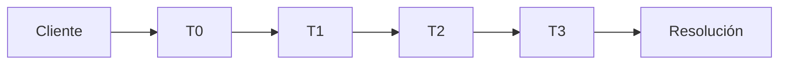

<OpeningQuestion />

<!--
Abrir sin responder de inmediato. Hacer una pausa real y pedir que la audiencia piense en un caso reciente.

La pregunta vuelve al cierre: el objetivo es que ingeniería continúe una investigación, en lugar de reconstruirla.

Tiempo: 0:30.
-->

---
layout: deck
---

<CoverSlide eyebrow="SOPORTE AUMENTADO POR INTELIGENCIA ARTIFICAL" line-one="RECIBIR" line-two="RESOLVER. PREVENIR." subtitle="Modelo operativo de soporte asistido: desde autoservicio hasta ingeniería." page="01">
  

    Amazon Connect + Amazon Bedrock AgentCore
    Contexto continuo, automatización gobernada y aprendizaje operativo
  

</CoverSlide>

<!--
La propuesta es un modelo operativo ITSM aumentado con IA: busca reducir trabajo repetido de investigación, acelerar la recuperación donde el riesgo lo permite y usar el aprendizaje de los incidentes para prevenir recurrencias.

Amazon Connect concentra la interacción con el cliente y el ciclo de soporte. El sistema ITSM mantiene el registro y la trazabilidad del caso. Amazon Bedrock AgentCore extiende la operación hacia investigación, herramientas y gobierno. La automatización determinística ejecuta runbooks aprobados.

[Pausa.] El contexto continuo no es el producto final: es el mecanismo que permite que cada escalación avance el trabajo, en lugar de reiniciarlo.

Basado en el modelo de soporte T0–T3 y continuidad de contexto de la propuesta original.
Tiempo: 0:45.
-->

---
layout: deck
---

<DeckSlide eyebrow="SITUACIÓN ACTUAL" title="La investigación queda" emphasis="fragmentada" page="02" source="Propuesta de diseño" :body-top="286" :body-bottom="96">
  
El caso avanza entre niveles, pero la información queda distribuida entre el ticket, las herramientas y las personas.

  

  

  

    
EN EL CASO
Cliente Prioridad Notas Historial

    
EN LAS HERRAMIENTAS
Logs Métricas Trazas Runbooks

    
EN LAS PERSONAS
Hipótesis Decisiones Contexto Conocimiento

  

  
La información existe. <b>Lo que falta es una investigación continua.</b>

</DeckSlide>

<!--
El problema no es que la información desaparezca. En muchos casos, la información existe. Parte está dentro del ticket: datos del cliente, clasificación, prioridad y notas. Otra parte está en herramientas técnicas: dashboards, logs, métricas, traces o runbooks. Y una parte importante permanece en el contexto de las personas que participaron en la investigación: por qué descartaron una hipótesis, qué buscaron o qué resultado esperaban de una acción.

[Pausa.] Cuando el caso escala, reconstruir esa historia requiere volver a consultar varias de esas fuentes. Por eso nuestra propuesta no consiste simplemente en hacer un resumen mejor del ticket. Queremos construir y conservar una investigación estructurada.

Tiempo: 1:45.
-->

---
layout: deck
---

<DeckSlide eyebrow="MODELO OPERATIVO ITSM" title="Automatización e IA" emphasis="cambian con el riesgo" page="03" source="Modelo de responsabilidad T0–T3 · catálogo final por confirmar" :body-top="300" :body-bottom="116">
  <OperatingModel />
</DeckSlide>

<!--
No queremos que la IA tenga el mismo papel en todos los niveles, ni confundirla con automatización. En T0, los escenarios repetibles pueden resolverse con autoservicio, reglas y runbooks determinísticos. En T1, IA y humano comparten investigación y acciones autorizadas. En T2, el especialista conserva el liderazgo mientras la IA correlaciona señales y recupera evidencia. En T3, ingeniería conserva la responsabilidad técnica.

[Pausa.] El punto es ajustar la intervención —automatización, IA o humano— al riesgo de cada decisión.

Catálogo final de acciones por riesgo: Por confirmar.
Tiempo: 1:45.
-->

---
layout: deck
---

<DeckSlide eyebrow="EJEMPLO ILUSTRATIVO" title="Cada escalación debe reducir" emphasis="el trabajo restante" page="04" source="Ejemplo ilustrativo · recorrido técnico por confirmar" :body-top="292" :body-bottom="94">
  <IncidentJourney />
</DeckSlide>

<!--
Ahora podemos comparar ambos modelos siguiendo exactamente el mismo incidente. El cliente entra por el mismo punto y puede recorrer los mismos niveles. No estamos eliminando el modelo T0–T3. Lo que cambia es qué ocurre durante cada transferencia.

En el recorrido tradicional, cada nivel recibe principalmente el caso y continúa investigando con sus propias herramientas. En el modelo propuesto, cada etapa también enriquece un contexto de investigación común.

[Pausa.] Para cuando llegamos a T3, la diferencia ya es significativa: el ingeniero no recibe únicamente una descripción del incidente. Recibe evidencia, acciones realizadas, resultados, correlaciones e hipótesis producidas durante todo el recorrido.

El ejemplo no representa un resultado medido ni una promesa de reducción de tiempo. Muestra cómo reducir el trabajo que debe repetirse antes de resolver.
Tiempo: 2:00.
-->

---
layout: deck
---

<DeckSlide eyebrow="RECUPERACIÓN AUTOMÁTICA" title="Self-healing no necesita" emphasis="ser una decisión de IA" page="05" source="Patrón de automatización determinística · runbooks y controles por confirmar" :body-top="300" :body-bottom="112">
  <SelfHealing />
</DeckSlide>

<!--
No toda la mejora operacional depende de IA. Para fallas conocidas y bien acotadas, el mecanismo preferible puede ser determinístico: una señal operativa activa una regla; la regla invoca un runbook aprobado; el flujo valida la recuperación, realiza rollback si aplica y actualiza el caso ITSM.

La IA puede ayudar a detectar patrones, explicar el incidente o recomendar el runbook correcto. Pero la ejecución debe seguir siendo explícita, repetible y gobernada. Esto es self-healing basado en procedimientos operativos, no autonomía abierta del modelo.

Tiempo: 1:45.
-->

---
layout: deck
---

<DeckSlide eyebrow="RESPONSABILIDADES DE PLATAFORMA" title="Tres responsabilidades." emphasis="Un solo ciclo de soporte." page="06" source="Capacidades específicas por validar contra documentación vigente">
  

    

      
AMAZON CONNECT

      

        
<b>Interacción con el cliente</b>Contacto, contexto funcional y asistencia

        
<b>Autoservicio y asistencia con IA</b>Resolución inicial y apoyo a agentes

        
<b>Enrutamiento y ciclo del caso</b>Colas, tareas y continuidad del journey

      

    

    

    

      
ITSM + AGENTCORE

      

        
<b>ITSM como sistema de registro</b>Casos, cambios, CMDB y trazabilidad operativa

        
<b>Automatización determinística</b>Runbooks aprobados, eventos y recuperación

        
<b>AgentCore para capacidades agénticas</b>Investigación, herramientas, políticas y observabilidad

      

    

  

</DeckSlide>

<!--
Esta separación evita que la arquitectura termine con dos capas de agentes haciendo lo mismo. Amazon Connect se mantiene como núcleo de la experiencia de soporte. ITSM es el sistema de registro para casos, cambios y trazabilidad. La automatización ejecuta procedimientos conocidos. AgentCore se utiliza cuando necesitamos agentes especializados para investigación, remediación o ingeniería, con acceso gobernado a herramientas empresariales.

El objetivo es tener responsabilidades complementarias: experiencia de soporte, control operativo y capacidades agénticas.

Uso de AI Agents in Amazon Connect y capacidades específicas de AgentCore: Por confirmar contra documentación vigente antes del deck final.
Tiempo: 2:00.
-->

---
layout: deck
---

<DeckSlide eyebrow="ARQUITECTURA DE REFERENCIA" title="Arquitectura de" emphasis="referencia" page="07" source="Arquitectura propuesta · componentes e integraciones por confirmar" :body-top="300" :body-bottom="106">
  <ArchitecturePlanes />
</DeckSlide>

<!--
Esta es la lámina técnica principal del deck. En la parte superior aparece el recorrido de soporte alrededor de Amazon Connect. El caso mantiene el contexto funcional y el estado del journey. Cuando se necesita investigación más profunda o acceso a herramientas técnicas, AgentCore proporciona agentes especializados.

El sistema ITSM conserva el registro del caso, los cambios y la trazabilidad operativa. Los runbooks operan de manera determinística sobre capacidades aprobadas. Los agentes no acceden directamente a todo el entorno: el acceso pasa por una capa gobernada de herramientas y políticas, con identidad, permisos y trazabilidad. Debajo están observabilidad, ITSM, automatización operativa, repositorios y workloads.

La arquitectura debe permitir que un arquitecto entienda rápidamente dónde empieza y termina cada responsabilidad.

Tiempo: 2:30.
-->

---
layout: deck
---

<DeckSlide eyebrow="AUTONOMÍA GOBERNADA" title="Razonar no es lo mismo" emphasis="que estar autorizado" page="08" source="R0–R3: propuesta de diseño · acciones y políticas por confirmar" :body-top="292" :body-bottom="116">
  <PolicyFlow />
</DeckSlide>

<!--
Esta lámina responde una pregunta fundamental de arquitectura: qué impide que un agente o una automatización haga algo que no debería. La respuesta no puede ser la confianza del modelo.

Separamos tres conceptos. Primero, razonamiento: el agente identifica una posible acción. Segundo, autorización: una política e identidad determinan si esa capacidad puede utilizarse y bajo qué condiciones. Tercero, aprobación: para determinadas acciones, una persona debe validar antes de ejecutar.

La clasificación R0–R3 es una propuesta del patrón y no una taxonomía oficial de AWS. Durante discovery, cada organización deberá definir qué operaciones pertenecen a cada nivel y qué controles aplican.

Tiempo: 1:50.
-->

---
layout: deck
---

<DeckSlide eyebrow="VALOR OPERACIONAL" title="Medir la mejora antes" emphasis="de prometerla" page="09" source="KPIs y baseline por confirmar durante discovery" :body-top="300" :body-bottom="116">
  <OutcomeMetrics />
</DeckSlide>

<!--
El valor de este modelo no se debe expresar como una promesa genérica de reducción de MTTR. Primero definimos el baseline del cliente y después medimos el cambio. Queremos observar cuántos casos se resuelven sin intervención, cuánto tarda la recuperación, cuánto trabajo de investigación se repite y cuántos incidentes recurrentes pueden prevenirse o mitigarse por runbooks.

[Pausa.] Estas son métricas de éxito del engagement. El discovery define las fuentes, el baseline y el escenario de MVP antes de comprometer cualquier resultado.

Tiempo: 1:30.
-->

---
layout: deck
---

<ClosingSlide />

<!--
Cerramos volviendo a la pregunta inicial. Parte del tiempo de operación debe ir a resolver y prevenir incidentes, no a reconstruir lo que ya se sabía. El contexto acumulado reduce retrabajo; la automatización determinística acelera recuperaciones conocidas; y la IA asiste en investigación y decisiones dentro de controles explícitos.

Amazon Connect sostiene el journey de soporte. ITSM mantiene el registro y la trazabilidad. AgentCore aporta las capacidades agénticas gobernadas. [Pausa.] El siguiente paso es formalizar este modelo como offering: discovery, arquitectura de referencia y un MVP end-to-end en un escenario de soporte concreto.

Alcance y escenario del MVP: Por confirmar.
Tiempo: 1:15.
-->

---
layout: deck
---

<DeckSlide eyebrow="ANEXO A1 · MAPA TÉCNICO" title="Arquitectura AWS" emphasis="de referencia" page="A1" :annex="true" source="Mapa técnico de trabajo · vista general; ampliar para revisar detalle" :body-top="272" :body-bottom="82">
  

</DeckSlide>

<!--
Usar este anexo cuando la conversación requiera profundizar en la implementación.

El mapa reúne el journey T0–T3, los planos de Amazon Connect y Bedrock AgentCore, las herramientas empresariales y las capacidades transversales de seguridad y gobierno.

Es una vista de referencia. Para revisar el detalle de cada componente, ampliar la lámina durante la conversación o abrir el archivo fuente de draw.io.
-->
